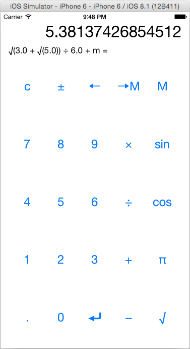

# RPN Calculator

[RPN](http://en.wikipedia.org/wiki/Reverse_Polish_notation) Calculator from [Developing iOS 8 Apps with Swift](https://itunes.apple.com/us/course/developing-ios-8-apps-swift/id961180099).

## Assignments
  * [Assignment #1](https://itunes.apple.com/ru/course/programming-project-1/id961180099?i=334226280&l=en&mt=2)
  * [Assignment #2](https://itunes.apple.com/ru/course/programming-project-2/id961180099?i=334824238&l=en&mt=2)

## My implementation
  * [Assignment #1](commit/06238ef) (required tasks and extra credit)
  * [Assignment #2](commit/447e7a9) (required tasks and extra credit)

Also unit tests for CalculatorBrain and integration tests for ViewController are implemented too.
