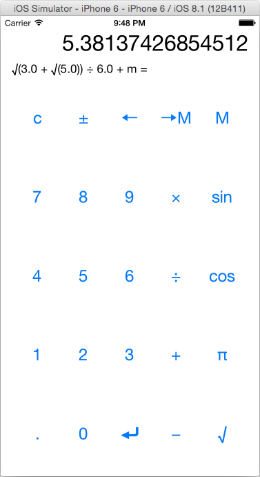

# RPN Calculator

[RPN](http://en.wikipedia.org/wiki/Reverse_Polish_notation) Calculator from [Developing iOS 8 Apps with Swift](https://itunes.apple.com/us/course/developing-ios-8-apps-swift/id961180099).

## My implementation
  * [Assignment #1](../../../tree/06238ef1417462350509412879c75253c27f769e) (required tasks and extra credit)
  * [Assignment #2](../../../tree/447e7a9f7e4ca43636d452e74f7bb4e7aaceecb5) (required tasks and extra credit)

Unit tests for CalculatorBrain and integration tests for ViewController are implemented too.
