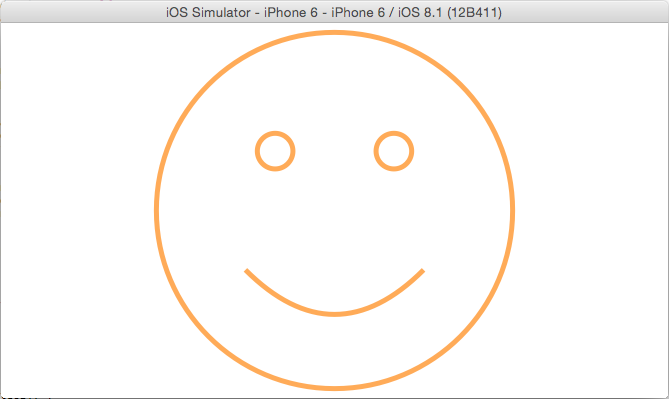

# Happiness

A swift demo project demostrated drawning a custom view and handling gestures.

See [Developing iOS 8 Apps with Swift](https://itunes.apple.com/us/course/developing-ios-8-apps-swift/id961180099) (lecture #5 and lecture #6).
